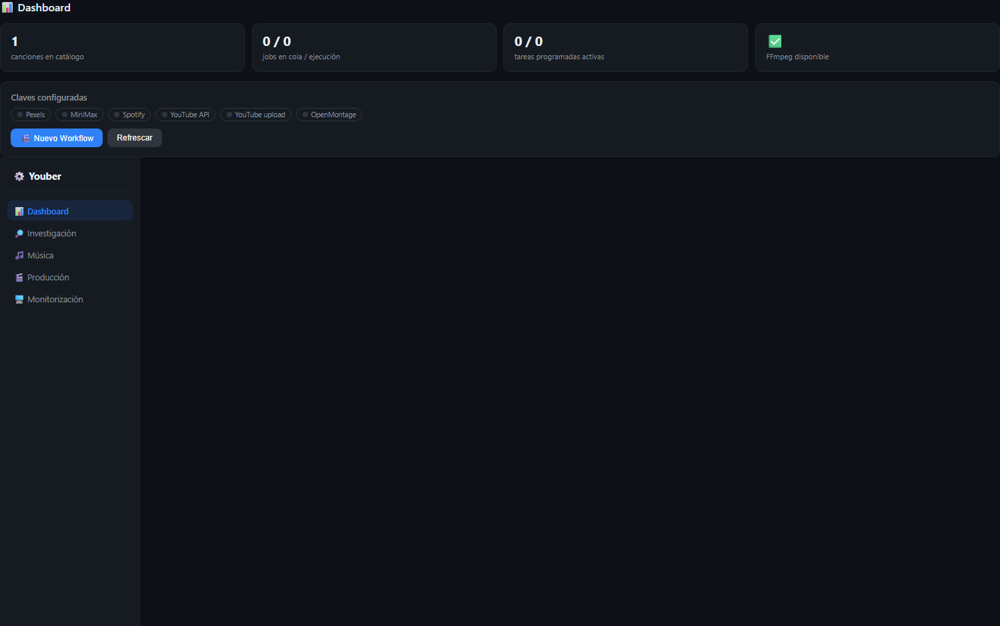
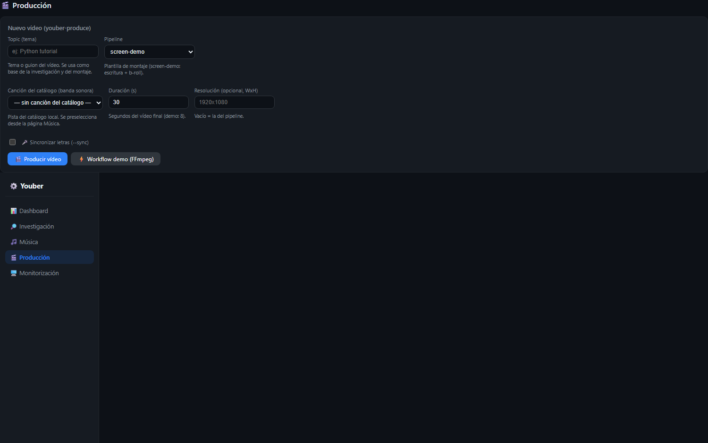
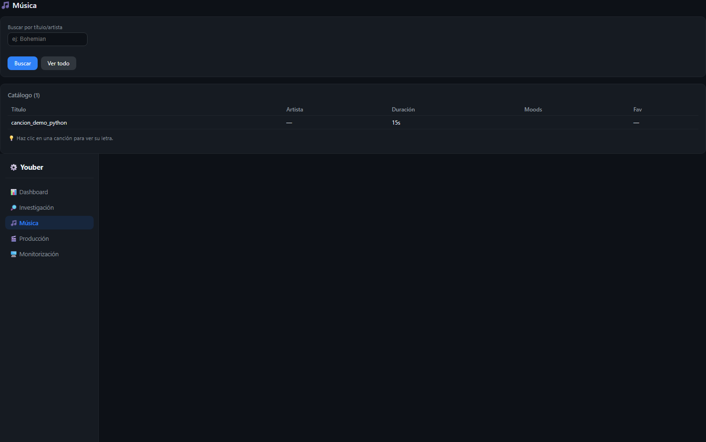
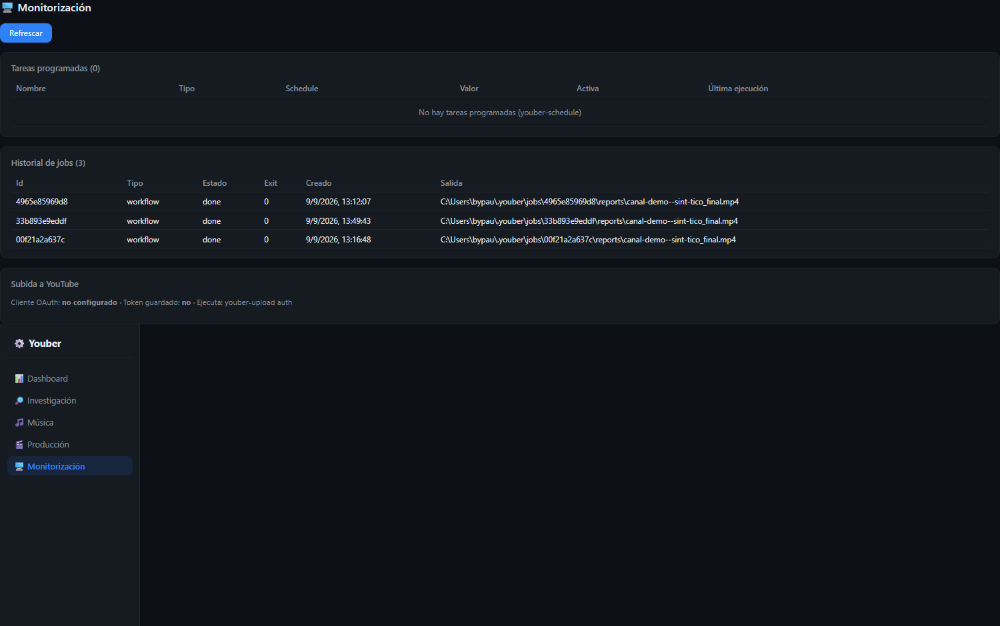

# Dashboard de Youber (Control UI)

Guía de uso del **tab "Youber"** del plugin `youber-dashboard`, la interfaz
nativa de Youber en la Control UI de OpenClaw (Fases 0-4).

> Para el plugin (instalación, configuración y modelo de seguridad) ver
> [PLUGIN.md](PLUGIN.md). Para el CLI de métricas `youber-dashboard`
> (widgets en HTML/Markdown/JSON) ver [METRICS.md](METRICS.md).

## Qué es

El dashboard es una SPA construida con **Vite + Lit** que se sirve desde el
plugin (`/youber-dashboard`) y habla con el **bridge JSON** (`youber.api`)
por HTTP. Todo corre en **localhost**; no necesita tokens ni credenciales
en el navegador (las claves API solo se consultan como *presencia* ✅/❌).

## Acceso

1. Control UI abierta → tab **Youber** (requiere scope `operator.read`).
2. URL directa: `http://127.0.0.1:18789/youber-dashboard/` (loopback).

## Páginas (5)

| Ruta | Página | Qué hace |
| --- | --- | --- |
| `#/dashboard` | **Dashboard** | Resumen: canciones en catálogo, jobs en cola/ejecución, tareas programadas, FFmpeg y proveedores configurados (solo booleanos) |
| `#/research` | **Investigación** | Busca canales por tema/categoría (modo auto/api/html/demo), analiza un canal al hacer clic (datos públicos + vídeos) y exporta CSV |
| `#/music` | **Música** | Catálogo local: busca por título/artista, haz clic en una pista para ver su **letra** (sidecar) y envíala a Producción |
| `#/production` | **Producción** | Lanza `youber-produce`/workflow (topic, pipeline, pista, duración, resolución, `--sync` con estilo de subtítulos) y sigue el job en vivo |
| `#/monitor` | **Monitorización** | Tareas programadas, historial de jobs (estado/exit/fecha/salida) y estado de la subida a YouTube |

## Flujos típicos

### Producir un vídeo

1. (opcional) En **Música**, haz clic en una canción → *Usar en producción*
   (la selección persiste entre páginas y recargas).
2. En **Producción**, rellena el *Topic*, elige pipeline/pista y duración.
   Activa *Sincronizar letras* si la pista tiene sidecar.
3. *Producir vídeo* → se lanza un job en segundo plano. La tarjeta de estado
   hace **polling cada 2 s** (5 s si el job va largo; se pausa con la pestaña
   oculta) y muestra el log.
4. Al terminar (✅ completado) aparece **⬇️ Descargar vídeo**: el MP4 se sirve
   desde `~/.youber/jobs/<id>/reports/` por el endpoint de descarga.

Si ya hay jobs en cola/ejecución, el dashboard pide **confirmación** antes
de encolar otro.

### Investigar + exportar

1. **Investigación**: tema + categoría + modo (`demo` no usa red).
2. Clic en un canal → análisis (suscriptores, vídeos, patrones).
3. *Guardar CSV* exporta los resultados a un fichero.

## Seguridad (resumen)

- Rutas del plugin: `auth:"plugin"` + **solo loopback**.
- **Origin guard**: solo se atienden peticiones sin `Origin`, con
  `Origin: null` (iframe sandbox de la Control UI) u orígenes loopback.
  Un sitio web abierto en el mismo navegador no puede leer ni lanzar jobs.
- Cabecera `X-Content-Type-Options: nosniff` en todo el prefijo.
- Las claves API **nunca viajan al navegador**: solo booleanos de presencia.
- La descarga valida el id del job y que el fichero esté dentro del
  directorio de jobs (sin path traversal).
- El id de `jobs.status` se valida en el bridge (formato seguro); no se
  ejecuta shell nunca (whitelist de flags por tipo de job).

## Solución de problemas

- La página no carga → ¿Gateway activa? `openclaw gateway status`.
- Página antigua/estática → el plugin sirve `dist/` (build de Vite). Si solo
  ves el HTML de Fase 2, ejecuta `npm ci && npm run build` en el plugin.
- Errores técnicos → ahora se muestran como mensajes humanos; el detalle
  queda en los logs de la Gateway (`openclaw gateway logs`).

